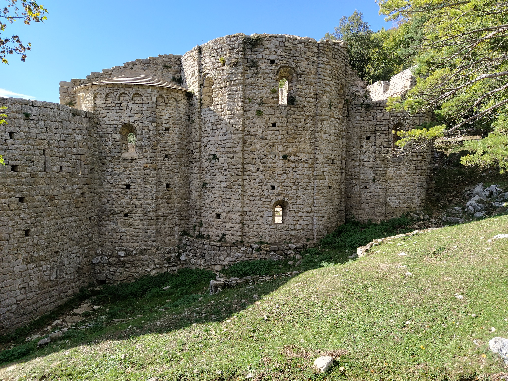

Aquest és el primer post en català!

Aquí hi ha una cita de la viquipèdia sobre Sant Llorenç de Sous: 
[Sant Llorenç de Sous](https://ca.wikipedia.org/wiki/Sant_Lloren%C3%A7_de_Sous).

> L'església de Sant Llorenç de Sous fou el temple parroquial de l'antic poble
> de masies disperses de Sous (Albanyà, Alt Empordà), actualment deshabitat.
> Antigament pertanyia a l'extingit municipi de Bassegoda, pertanyent a la Garrotxa.

