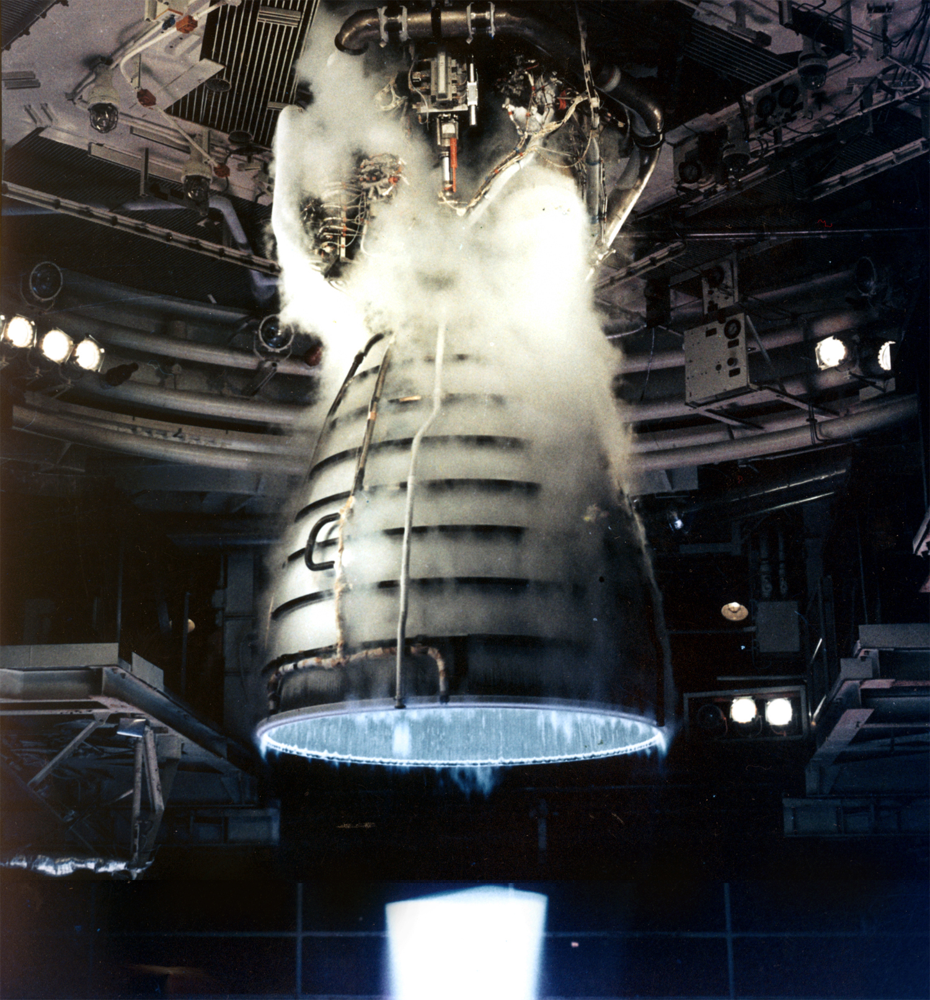

> De: https://ca.wikipedia.org/wiki/Hidrogen

L'__hidrogen__ és un element químic de símbol H i nombre atòmic 1. Té un pes atòmic mitjà d'1,00784 uma, la qual cosa el converteix en l'element més lleuger. En la seva forma monoatòmica (H) és la substància química més abundant: constitueix aproximadament el 75% de la massa bariònica de l'univers.[3] Les estrelles no romanents estan compostes principalment d'hidrogen en el seu estat de plasma.

En condicions estàndard de temperatura i pressió, l'hidrogen és incolor, inodor, insípid, no tòxic, no metàl·lic, i altament combustible; pren la forma d'un gas diatòmic de fórmula molecular H
2. L'hidrogen atòmic d'ocurrència natural és molt rar a la Terra, ja que forma fàcilment compostos covalents amb la majoria d'elements i es troba present a la molècula d'aigua i en la majoria de compostos orgànics. L'hidrogen té un paper molt important en la química d'àcid-base: en moltes reaccions s'intercanvien protons entre molècules solubles.

En compostos iònics, l'hidrogen pot prendre una càrrega negativa (en forma d'un anió conegut com a hidrur que s'escriu H−), o bé una càrrega positiva (catió H+). Aquest darrer s'escriu com si fos un simple protó però, en realitat, els cations d'hidrogen en compostos iònics ocorren en espècies més complexes. D'altra banda, l'isòtop més comú de l'hidrogen és el proti (símbol 1H), que té un sol protó i cap neutró. Com que es tracta de l'àtom conegut més simple, l'àtom d'hidrogen ha estat molt utilitzat per resoldre problemes teòrics: per exemple, com que és l'únic àtom neutre que té una solució analítica de l'equació de Schrödinger, l'estudi de l'energètica i dels enllaços de l'àtom d'hidrogen tingué un paper clau en el desenvolupament de la mecànica quàntica.

L'hidrogen gas fou produït artificialment per primer cop als inicis del segle XVI mitjançant la barreja de metalls i àcids forts. En els anys 1766–81, Henry Cavendish fou el primer a reconèixer que l'hidrogen era una substància distinta[4] i que produeix aigua quan es crema, propietat que més tard li donà a l'element el seu nom actual: el nom «hidrogen» és una derivació del grec que significa 'formador d'aigua'.

La producció industrial es fa principalment a partir del reformat amb vapor de gas natural i, menys freqüentment, a partir de mètodes de producció d'hidrogen com l'electròlisi de l'aigua.[5] La majoria de l'hidrogen es fa servir prop del seu lloc de producció; els dos usos majoritaris són el processament de combustible fòssil (per exemple, l'hidrocraqueig) i la producció d'amoníac, bàsicament pel mercat de fertilitzants. Finalment, l'hidrogen és una preocupació important en l'àmbit de la metal·lúrgia, ja que pot fragilitzar molts metalls,[6] cosa que complica el disseny de productes com canonades i dipòsits d'emmagatzematge.
