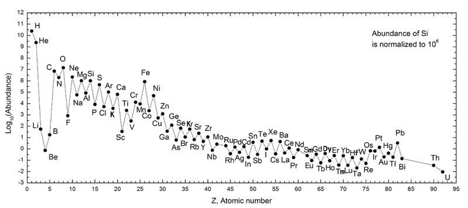
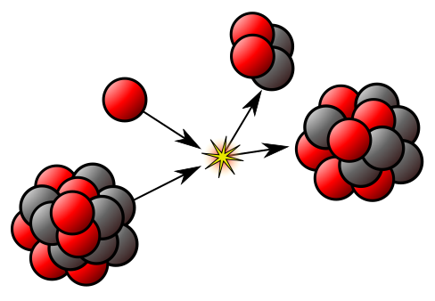

> From [Wikipedia](https://en.wikipedia.org/wiki/Chemical_element)

A __chemical element__ is a species of atom having the same number of protons in their atomic nuclei (that is, the same atomic number, or Z)[^ IUPAC, Compendium of Chemical Terminology, 2nd ed. (the "Gold Book") (1997). Online corrected version: (2006–) "chemical element". doi:10.1351/goldbook.C01022]. For example, the atomic number of oxygen is 8, so the element oxygen describes all atoms which have 8 protons.

One hundred eighteen elements have been identified: the first 94 occur naturally on Earth, and the remaining 24 are synthetic elements. There are 80 elements that have at least one stable isotope and 38 that have exclusively [radionuclides](./radionuclides), which decay over time into other elements. Iron is the most abundant element (by mass) making up Earth, while oxygen is the most common element in the Earth's crust.[^Los Alamos National Laboratory (2011). "Periodic Table of Elements: Oxygen". Los Alamos, New Mexico: Los Alamos National Security, LLC. Retrieved 7 May 2011.]

Chemical elements constitute all of the ordinary matter of the universe. However astronomical observations suggest that ordinary observable matter makes up only about 15% of the matter in the universe. The remainder is dark matter; the composition of this is unknown, but it is not composed of chemical elements.[^Oerter, Robert (2006). The Theory of Almost Everything: The Standard Model, the Unsung Triumph of Modern Physics. Penguin. p. 223. ISBN 978-0-452-28786-0.] The two lightest elements, hydrogen and helium, were mostly formed in the Big Bang and are the most common elements in the universe. The next three elements (lithium, beryllium and boron) were formed mostly by cosmic ray spallation, and are thus rarer than heavier elements. Formation of elements with from 6 to 26 protons occurs in main sequence stars via stellar nucleosynthesis. The high abundance of oxygen, silicon, and iron on Earth reflects their common production in such stars. Elements with greater than 26 protons are formed by supernova nucleosynthesis in supernovae, which, when they explode, blast these elements as supernova remnants far into space, where they may become incorporated into planets when they are formed.

The term "element" is used for atoms with a given number of protons (regardless of whether or not they are ionized or chemically bonded, e.g. hydrogen in water) as well as for a pure chemical substance consisting of a single element (e.g. hydrogen gas).[^1] For the second meaning, the terms "elementary substance" and "simple substance" have been suggested, but they have not gained much acceptance in English chemical literature, whereas in some other languages their equivalent is widely used (e.g. French _corps simple_, Russian _простое вещество_). A single element can form multiple substances differing in their structure; they are called allotropes of the element.

When different elements are chemically combined, with the atoms held together by chemical bonds, they form chemical compounds. Only a minority of elements are found uncombined as relatively pure minerals. Among the more common of such native elements are copper, silver, gold, carbon (as coal, graphite, or diamonds), and sulfur. All but a few of the most inert elements, such as noble gases and noble metals, are usually found on Earth in chemically combined form, as chemical compounds. While about 32 of the chemical elements occur on Earth in native uncombined forms, most of these occur as mixtures. For example, atmospheric air is primarily a mixture of nitrogen, oxygen, and argon, and native solid elements occur in alloys, such as that of iron and nickel.

The history of the discovery and use of the elements began with primitive human societies that found native elements like carbon, sulfur, copper and gold (though the status of these materials as elements was not known at the time). Later civilizations extracted elemental copper, tin, lead and iron from their ores by smelting, using charcoal. Alchemists and chemists subsequently identified many more; all of the naturally occurring elements were known by 1950.

The properties of the chemical elements are summarized in the [periodic table](../periodic-table), which organizes the elements by increasing atomic number into rows ("periods") in which the columns ("groups") share recurring ("periodic") physical and chemical properties. Save for unstable radioactive elements with short half-lives, all of the elements are available industrially, most of them in low degrees of impurities.

## Atomic number
Main article: [atomic number](https://en.wikipedia.org/wiki/Atomic_number)

The atomic number of an element is equal to the number of protons in each atom, and defines the element.[^"Atomic Number and Mass Numbers". ndt-ed.org. Retrieved 17 February 2013.] For example, all carbon atoms contain 6 protons in their atomic nucleus; so the atomic number of carbon is 6.[^periodic.lanl.gov. "Periodic Table of Elements: LANL Carbon". Los Alamos National Laboratory.] Carbon atoms may have different numbers of neutrons; atoms of the same element having different numbers of neutrons are known as isotopes of the element.[^Katsuya Yamada. "Atomic mass, isotopes, and mass number" (PDF). Los Angeles Pierce College. Archived from the original (PDF) on 11 January 2014.]

The number of protons in the atomic nucleus also determines its electric charge, which in turn determines the number of electrons of the atom in its non-ionized state. The electrons are placed into atomic orbitals that determine the atom's various chemical properties. The number of neutrons in a nucleus usually has very little effect on an element's chemical properties (except in the case of hydrogen and deuterium). Thus, all carbon isotopes have nearly identical chemical properties because they all have six protons and six electrons, even though carbon atoms may, for example, have 6 or 8 neutrons. That is why the atomic number, rather than mass number or atomic weight, is considered the identifying characteristic of a chemical element.

The symbol for atomic number is Z.

## Isotopes
Main articles: [Isotope](https://en.wikipedia.org/wiki/Isotope)

Isotopes are atoms of the same element (that is, with the same number of protons in their atomic nucleus), but having different numbers of neutrons. Thus, for example, there are three main isotopes of carbon. All carbon atoms have 6 protons in the nucleus, but they can have either 6, 7, or 8 neutrons. Since the mass numbers of these are 12, 13 and 14 respectively, the three isotopes of carbon are known as carbon-12, carbon-13, and carbon-14, often abbreviated to 12C, 13C, and 14C. Carbon in everyday life and in chemistry is a mixture of 12C (about 98.9%), 13C (about 1.1%) and about 1 atom per trillion of 14C.

Most (66 of 94) naturally occurring elements have more than one stable isotope. Except for the isotopes of hydrogen (which differ greatly from each other in relative mass—enough to cause chemical effects), the isotopes of a given element are chemically nearly indistinguishable.

All of the elements have some isotopes that are radioactive (radioisotopes), although not all of these radioisotopes occur naturally. The radioisotopes typically decay into other elements upon radiating an alpha or beta particle. If an element has isotopes that are not radioactive, these are termed "stable" isotopes. All of the known stable isotopes occur naturally (see primordial isotope). The many radioisotopes that are not found in nature have been characterized after being artificially made. Certain elements have no stable isotopes and are composed only of radioactive isotopes: specifically the elements without any stable isotopes are technetium (atomic number 43), promethium (atomic number 61), and all observed elements with atomic numbers greater than 82.

Of the 80 elements with at least one stable isotope, 26 have only one single stable isotope. The mean number of stable isotopes for the 80 stable elements is 3.1 stable isotopes per element. The largest number of stable isotopes that occur for a single element is 10 (for tin, element 50).
