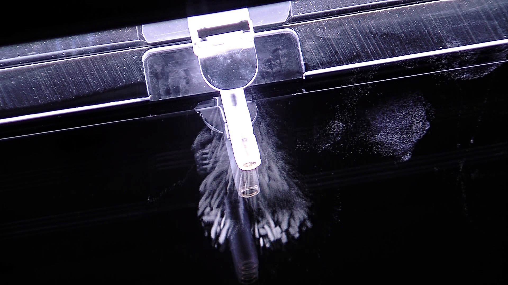

> De: https://ca.wikipedia.org/wiki/Radiois%C3%B2top

Un __radioisòtop__, __isòtop radioactiu__ o __isòtop inestable__, és un tipus d'isòtop que es caracteritza per tenir un nucli atòmic inestable que es transforma espontàniament en un altre més estable alhora que deixa anar radioactivitat. L'energia alliberada en transformar-se (radioactivitat) pot detectar-se per exemple amb un comptador Geiger o amb una pel·lícula fotogràfica.

Alguns isòtops radioactius tenen usos en medicina. Per exemple, un isòtop del tal·li pot identificar vasos sanguinis bloquejats en persones sense haver-los-hi d'obrir el cos.

