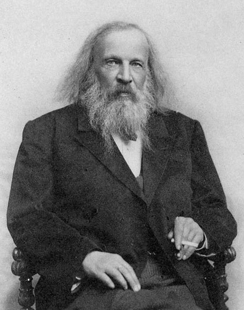

> From: https://en.wikipedia.org/wiki/Dmitri_Mendeleev

Dmitri Ivanovich Mendeleev (often romanized as Mendeleyev or Mendeleef) (English: /ˌmɛndəlˈeɪəf/ MEN-dəl-AY-əf;[^"Mendeleev". Random House Webster's Unabridged Dictionary.] Russian: Дмитрий Иванович Менделеев,[^In Mendeleev's day, his name was written Дмитрій Ивановичъ Менделѣевъ.] tr. Dmítriy Ivánovich Mendeléyev, IPA: [ˈdmʲitrʲɪj ɪˈvanəvʲɪtɕ mʲɪnʲdʲɪˈlʲejɪf]; 8 February 1834 – 2 February 1907 [OS 27 January 1834 – 20 January 1907]) was a Russian chemist and inventor. He is best remembered for formulating the Periodic Law and creating a farsighted version of the [periodic table of elements](../periodic-table). He used the Periodic Law not only to correct the then-accepted properties of some known elements, such as the valence and atomic weight of uranium, but also to predict the properties of eight elements that were yet to be discovered.

## Early life
Mendeleev was born in the village of Verkhnie Aremzyani, near Tobolsk in Siberia, to Ivan Pavlovich Mendeleev (1783–1847) and Maria Dmitrievna Mendeleeva (née Kornilieva) (1793–1850). Ivan worked as a school principal and a teacher of fine arts, politics and philosophy at the Tambov and Saratov gymnasiums. Ivan's father, Pavel Maximovich Sokolov, was a Russian Orthodox priest from the Tver region.[6] As per the tradition of priests of that time, Pavel's children were given new family names while attending the theological seminary, with Ivan getting the family name Mendeleev after the name of a local landlord.

## Periodic table
In 1863, there were 56 known elements with a new element being discovered at a rate of approximately one per year. Other scientists had previously identified periodicity of elements. John Newlands described a Law of Octaves, noting their periodicity according to relative atomic weight in 1864, publishing it in 1865. His proposal identified the potential for new elements such as germanium. The concept was criticized and his innovation was not recognized by the Society of Chemists until 1887. Another person to propose a periodic table was Lothar Meyer, who published a paper in 1864 describing 28 elements classified by their valence, but with no predictions of new elements.

## Later life

In 1876, he became obsessed with Anna Ivanova Popova and began courting her; in 1881 he proposed to her and threatened suicide if she refused. His divorce from Leshcheva was finalized one month after he had married Popova (on 2 April) in early 1882. Even after the divorce, Mendeleev was technically a bigamist; the Russian Orthodox Church required at least seven years before lawful remarriage. His divorce and the surrounding controversy contributed to his failure to be admitted to the Russian Academy of Sciences (despite his international fame by that time). His daughter from his second marriage, Lyubov, became the wife of the famous Russian poet Alexander Blok. His other children were son Vladimir (a sailor, he took part in the notable Eastern journey of Nicholas II) and daughter Olga, from his first marriage to Feozva, and son Ivan and twins from Anna.

Though Mendeleev was widely honored by scientific organizations all over Europe, including (in 1882) the Davy Medal from the Royal Society of London (which later also awarded him the Copley Medal in 1905), he resigned from Saint Petersburg University on 17 August 1890. He was elected a Foreign Member of the Royal Society (ForMemRS) in 1892, and in 1893 he was appointed director of the Bureau of Weights and Measures, a post which he occupied until his death.
