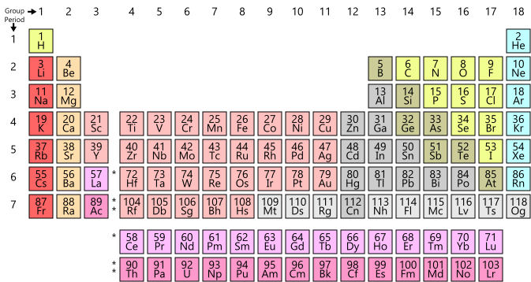

> From [Wikipedia](https://en.wikipedia.org/wiki/Periodic_table)

The __periodic table__, also known as the _periodic table of elements_, is a tabular display of the [chemical elements](../chemical-elements), which are arranged by atomic number, electron configuration, and recurring chemical properties. The structure of the table shows periodic trends. The seven rows of the table, called periods, generally have metals on the left and non-metals on the right. The columns, called groups, contain elements with similar chemical behaviours. Six groups have accepted names as well as assigned numbers: for example, group 17 elements are the halogens; and group 18 are the noble gases. Also displayed are four simple rectangular areas or blocks associated with the filling of different atomic orbitals.

The elements from atomic numbers 1 (hydrogen) through 118 (oganesson) have been discovered or synthesized, completing seven full rows of the periodic table.[^"Chemistry: Four elements added to periodic table". BBC News. 4 January 2016. Archived from the original on 4 January 2016.][^St. Fleur, Nicholas (1 December 2016). "Four New Names Officially Added to the Periodic Table of Elements". New York Times. Archived from the original on 14 August 2017.] The first 94 elements all occur naturally, though some are found only in trace amounts and a few were discovered in nature only after having first been synthesized.[^The elements discovered initially by synthesis and later in nature are technetium (Z=43), promethium (61), astatine (85), neptunium (93), plutonium (94), americium (95), curium (96), berkelium (97) and californium (98).] Elements 95 to 118 have only been synthesized in laboratories or nuclear reactors. The synthesis of elements having higher atomic numbers is currently being pursued: these elements would begin an eighth row, and theoretical work has been done to suggest possible candidates for this extension. Numerous synthetic radionuclides of naturally occurring elements have also been produced in laboratories.

The organization of the periodic table can be used to derive relationships between the various element properties, and also to predict chemical properties and behaviours of undiscovered or newly synthesized elements. Russian chemist [Dmitri Mendeleev](../mendeleev) published the first recognizable periodic table in 1869, developed mainly to illustrate periodic trends of the then-known elements. He also predicted some properties of unidentified elements that were expected to fill gaps within the table. Most of his forecasts proved to be correct. Mendeleev's idea has been slowly expanded and refined with the discovery or synthesis of further new elements and the development of new theoretical models to explain chemical behaviour. The modern periodic table now provides a useful framework for analyzing chemical reactions, and continues to be widely used in chemistry, nuclear physics and other sciences.

## Overview

Each chemical element has a unique atomic number (Z) representing the number of protons in its nucleus.[^An element zero (i.e. a substance composed purely of neutrons), is included in a few alternate presentations, for example, in the Chemical Galaxy.] Most elements have differing numbers of neutrons among different atoms, with these variants being referred to as isotopes. For example, carbon has three naturally occurring isotopes: all of its atoms have six protons and most have six neutrons as well, but about one per cent have seven neutrons, and a very small fraction have eight neutrons. Isotopes are never separated in the periodic table; they are always grouped together under a single element. Elements with no stable isotopes have the atomic masses of their most stable isotopes, where such masses are shown, listed in parentheses.[^Greenwood & Earnshaw, pp. 24–27]

In the standard periodic table, the elements are listed in order of increasing atomic number Z (the number of protons in the nucleus of an atom). A new row (period) is started when a new electron shell has its first electron. Columns (groups) are determined by the electron configuration of the atom; elements with the same number of electrons in a particular subshell fall into the same columns (e.g. oxygen and selenium are in the same column because they both have four electrons in the outermost p-subshell). Elements with similar chemical properties generally fall into the same group in the periodic table, although in the f-block, and to some respect in the d-block, the elements in the same period tend to have similar properties, as well. Thus, it is relatively easy to predict the chemical properties of an element if one knows the properties of the elements around it.

Since 2016, the periodic table has 118 confirmed elements, from element 1 (hydrogen) to 118 (oganesson). Elements 113, 115, 117 and 118, the most recent discoveries, were officially confirmed by the International Union of Pure and Applied Chemistry (IUPAC) in December 2015. Their proposed names, nihonium (Nh), moscovium (Mc), tennessine (Ts) and oganesson (Og) respectively, were announced by the IUPAC in June 2016 and made official in November 2016.

The first 94 elements occur naturally; the remaining 24, americium to oganesson (95–118), occur only when synthesized in laboratories. Of the 94 naturally occurring elements, 83 are primordial and 11 occur only in decay chains of primordial elements. No element heavier than einsteinium (element 99) has ever been observed in macroscopic quantities in its pure form, nor has astatine (element 85); francium (element 87) has been only photographed in the form of light emitted from microscopic quantities (300,000 atoms).

## Grouping methods

### Groups

A group or family is a vertical column in the periodic table. Groups usually have more significant periodic trends than periods and blocks, explained below. Modern quantum mechanical theories of atomic structure explain group trends by proposing that elements within the same group generally have the same electron configurations in their valence shell. Consequently, elements in the same group tend to have a shared chemistry and exhibit a clear trend in properties with increasing atomic number. In some parts of the periodic table, such as the d-block and the f-block, horizontal similarities can be as important as, or more pronounced than, vertical similarities.

Under an international naming convention, the groups are numbered numerically from 1 to 18 from the leftmost column (the alkali metals) to the rightmost column (the noble gases). Previously, they were known by roman numerals. In America, the roman numerals were followed by either an "A" if the group was in the s- or p-block, or a "B" if the group was in the d-block. The roman numerals used correspond to the last digit of today's naming convention (e.g. the group 4 elements were group IVB, and the group 14 elements were group IVA). In Europe, the lettering was similar, except that "A" was used if the group was before group 10, and "B" was used for groups including and after group 10. In addition, groups 8, 9 and 10 used to be treated as one triple-sized group, known collectively in both notations as group VIII. In 1988, the new IUPAC naming system was put into use, and the old group names were deprecated.

Some of these groups have been given trivial (unsystematic) names, as seen in the table below, although some are rarely used. Groups 3–10 have no trivial names and are referred to simply by their group numbers or by the name of the first member of their group (such as "the scandium group" for group 3), since they display fewer similarities and/or vertical trends.

Elements in the same group tend to show patterns in atomic radius, ionization energy, and electronegativity. From top to bottom in a group, the atomic radii of the elements increase. Since there are more filled energy levels, valence electrons are found farther from the nucleus. From the top, each successive element has a lower ionization energy because it is easier to remove an electron since the atoms are less tightly bound. Similarly, a group has a top-to-bottom decrease in electronegativity due to an increasing distance between valence electrons and the nucleus. There are exceptions to these trends: for example, in group 11, electronegativity increases farther down the group.
